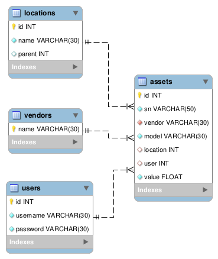

# dbAPI: Instant REST API generation for MySQL databases
dbAPI is a middleware tool designed to simplify the process of generating REST APIs  specifically for MySQL databases. It provides developers with an intuitive platform to automate the creation of these APIs, eliminating the need for manual development, which can be time-consuming and error-prone.

With dbAPI, developers can quickly and easily generate clean, well-documented APIs that are tailored to their MySQL database schema. This automation streamlines the development process, allowing developers to focus on other aspects of their projects.

One of the key features of dbAPI is its versatility and adaptability. It can be used for various types of projects, including web applications, mobile apps, extending existing applications and more. Additionally, dbAPI includes built-in security measures to protect data, such as encryption, authentication mechanisms, and role-based access control.

Overall, dbAPI empowers developers to efficiently interact with MySQL databases by providing a seamless solution for generating REST APIs.

#Features
- automatic API endpoints generation for creating, reading, updating and deleting data in a MySQL database
- implements JSONAPI specification to allow recursive retrieval and creation of linked resources 
- automatic API documentation  generation in Swagger format
- authentication: offers authentication endpoints which can be customized by defining the SQL query.
- authorization: ACL based
- error handling: provides informative error messages in case of invalid requests, server errors, or other exceptional conditions. Error responses include HTTP status codes, error codes, and human-readable descriptions to help developers diagnose and troubleshoot issues.
- scalability: being stateless, it can horizontally scale to any number of instances. 
- performance: uses **OPcache** for storing precompiled script bytecode in shared memory and **memcached** for caching data 
- security: implements security best practices to protect against common threats such as injection attacks, cross-site scripting (XSS), and cross-site request forgery (CSRF). This involves input validation, parameterized queries, and encryption of sensitive data.
- multi-database: one dbAPI instance can be used to connect to multiple databases, each with their separate entry endpoint, access and authorization rules  

## Table of contents
- [Instalation](#install)
- [Configuration](#config)
- [Usage](#use)

## Installation

### Prerequisites

You can run the app either by installing it under the docroot of a web server or using the PHP built in server. 

- a running Apache (prefered because of support of mod_rewrite and htaccess files) web server with PHP 7.4 support. Might be working as well with PHP8, but I've never tested it.
- PHP7.4
- composer (https://getcomposer.org/)

\* (A docker container is on it's way. Stay tuned)
### Install
Clone repo, install dependencies and make configure rights  

    mkdir dbapi
    cd dbapi
    git clone https://github.com/vsergione/dbapi .
    composer install
    chmod 777 dbconfigs

Optional: launch PHP built in web server
    php -S localhost:4343  

## Setup

### Setup

Multiple databases/APIs can be set up using the same instance.  

Setting up the API for a MySQL database is as easy as making a POST request to http://localhost:4343/apis/ (when using the PHP built in webserver, otherwise is http(s)://your_host_name/installation_path/apis/ with the following payload)

    {
        "name":"example",
        "connection":{
            "dbdriver":"mysqli",
            "hostname": "dbhost",
            "username": "dbuser",
            "password": "dbpass",
            "database": "dbname"
        },
        "security": {
            "from":["0.0.0.0/0","::/0","1::"],
            "rules":[
                ["/.*/i","/.*/i","allow"]
            ],
            "default_policy":"accept"
        }
    }
 
 There is an extra API for managing the API itself. Documentation still in the making...
    
 ## Use
 Let's assume the following database structure
 
 
 
 
 ### READING DATA
 
 Once the DB is connected the following API endpoints are availble to use:
 - .../apis/{{apiName}}/{{tableOrViewName}}
    - GET: will list the contents of {{tableOrViewName}}. The request supports the following query parameters:
        - page[{{tableOrViewName}}][offset]=0 - offset from where the records will be listed
        - page[{{tableOrViewName}}][limit]=10 - page size
        - sort=(-){{fieldName1}},(-){{fieldName2}} - sort by fields. Default is ascending. Minus '-' in front of the fieldname is for descending
        - filter=(filter1),(filter2), where filters can be like
            - field=value - field equals value 
            - field>value - field greater than value
            - field>=value - field greater than or equal value
            - field<value - field less than value
            - field<=value - field less or equal than value
            - field=~value - field starts with value
            - field~=value - field ends with value
            - field~=~value - field contains with value
            - field><value1;value2... - field is one of the values 
         - fields=field1,field2... - sparse field selection: commas separate list of fields to be included
         - include=relation1,relation2,relation1.subrelation3... - recursive inclusion of relations (1:1 and 1:n)     
                                    
 
 As per the above structure the following endpoints are available
 - .../apis/example/vendors
    - GET will return a list of vendors. The request can be parametrized with: page[vendors][offset], page[vendors][limit], filter, fields, include 
 - .../apis/example/vendors/{vendorName}
 - .../apis/example/vendors/{vendorName}/assets
 - .../apis/example/assets
 - .../apis/example/assets/{assetId}
 - .../apis/example/assets/{assetId}/vendor
 - .../apis/example/assets/{assetId}/location
 - .../apis/example/assets/{assetId}/user
 - .../apis/example/locations
 - .../apis/example/locations/{locationId}
 - .../apis/example/locations/{locationId}/assets
 - .../apis/example/users
 - .../apis/example/users/{userId}
 - .../apis/example/users/{userId}/assets
 